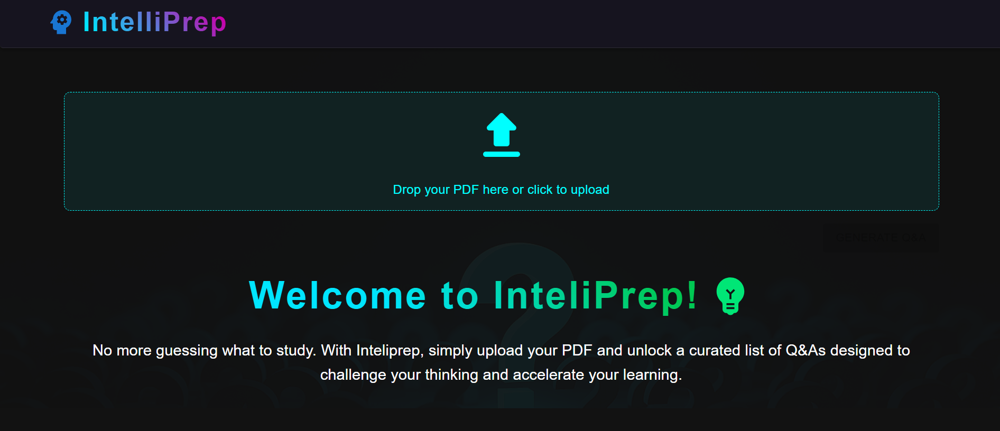
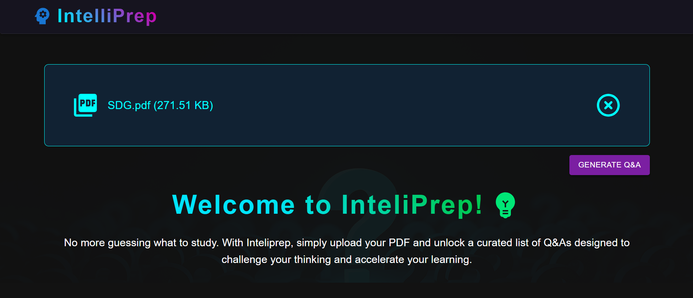
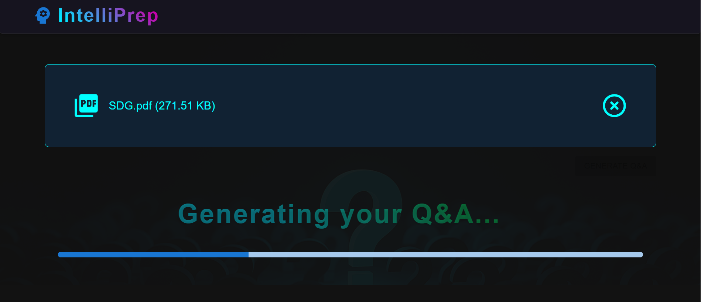
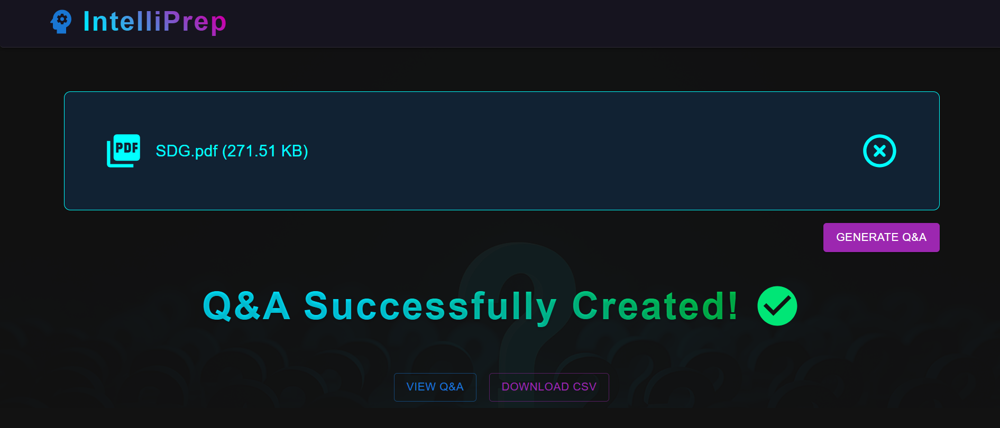
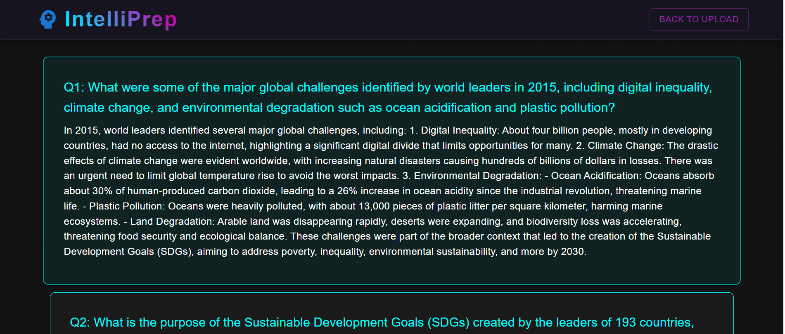

# **IntelliPrep** - Interview Questions Creator



A web application that generates interview-style Q&A pairs from your uploaded PDF documents using advanced language models.

## Features

- **PDF Upload:** Upload any PDF document.
- **Automatic Q&A Generation:** Extracts content and generates relevant questions and answers using LLMs.
- **Download as CSV:** Export generated Q&A pairs as a CSV file.
- **Modern UI:** Built with Material UI and React for a smooth user experience.

## Tech Stack

- **Frontend:** React, Material UI
- **Backend:** FastAPI (Python)
- **LLM Integration:** LangChain, OpenAI API (or compatible endpoints)
- **Vector Store:** FAISS
- **PDF Parsing:** LangChain PyPDFLoader

## Getting Started

### Prerequisites

- Node.js (v18+ recommended)
- [Conda](https://docs.conda.io/en/latest/miniconda.html) (for backend Python environment)
- [OpenAI API Key](https://platform.openai.com/account/api-keys) **or** a GitHub access token (see note below)
- [pip](https://pip.pypa.io/en/stable/)

> **Note:**  
> You can use a GitHub access token as the API key for the OpenAI client in this project.  
> See [here](https://github.com/marketplace/models/azure-openai/gpt-4o-mini) for more details.

### 1. Clone the Repository

```sh
git clone https://github.com/yourusername/interview-questions-creator.git
cd interview-questions-creator
```

### 2. Backend Setup (with Conda)

1. **Create and activate a Conda environment:**

   ```sh
   conda create -n interview-qa python=3.10 -y
   conda activate interview-qa
   ```

2. **Install dependencies:**

   ```sh
   pip install -r requirements.txt
   ```

3. **Set up environment variables:**

   - Create a `.env` file in your project root:
     ```
     OPENAI_API_KEY=your_openai_api_key_or_github_token
     ```

4. **Run the backend server:**

   ```sh
   python app.py
   ```

- The backend will run at [http://localhost:8000](http://localhost:8000)

### 3. Frontend Setup

```sh
cd app
npm install
npm run dev
```

- The frontend will run on [http://localhost:5173](http://localhost:5173)

## Customization

- **Model:** Change the LLM or embedding model in the [`src/helper.py`](src/helper.py).
- **Prompt:** Edit the prompt templates in the [`src/prompt.py`](src/prompt.py) for different Q&A styles.

## Usage

1. Open the web app in your browser.

   

2. Upload a PDF file and click **GENERATE Q&A**.

   

3. Wait a few moments while your questions and answers are generated (this may take a few minutes).

   

4. Once you see the success message, click **DOWNLOAD CSV** to save the Q&A pairs, or click **VIEW Q&A** to see the results in the app.

   

5. You can now view your generated questions and answers as shown below.

   

